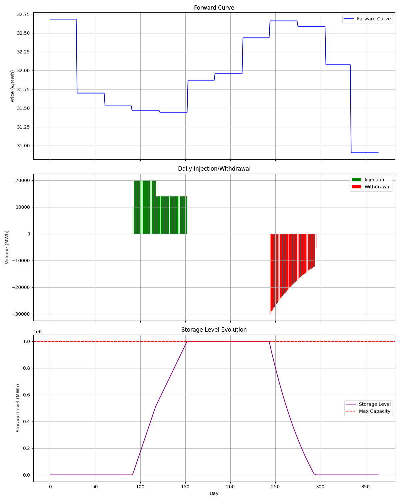

# Gas Storage Optimization Project

## Overview

This project provides a robust solution for optimizing natural gas storage operations to maximize profit in underground gas storage (UGS) auctions. It implements a linear programming model that determines the optimal injection and withdrawal strategy based on forward curve prices and storage facility constraints.

The optimization considers:
- Daily market prices from a forward curve
- Storage capacity constraints
- Variable injection and withdrawal rates based on storage fill levels
- Operational costs

## Theoretical Background

### Gas Storage Economics

Underground Gas Storage (UGS) facilities play a crucial role in the natural gas market by providing flexibility to balance supply and demand. They allow operators to:
1. **Buy low, sell high**: Inject gas when prices are low and withdraw when prices are high
2. **Manage seasonal price spreads**: Take advantage of seasonal price differentials
3. **Provide supply flexibility**: Support system balancing and security of supply

### Optimization Model: Linear Programming

The core of this project is a linear programming (LP) model that maximizes the intrinsic value of the storage asset. The intrinsic value represents the profit potential from a static, deterministic strategy based on current forward prices.

#### Key Components of the LP Model:

1. **Decision Variables**:
   - Daily injection volumes
   - Daily withdrawal volumes 
   - Storage inventory levels
   - Binary variables for injection regime switching

2. **Objective Function**:
   - Maximize: Revenue from gas sales - Cost of gas purchases - Variable operational costs

3. **Constraints**:
   - Storage balance equations (continuity constraints)
   - Maximum and minimum storage levels
   - Injection rate limitations (dependent on storage fill level)
   - Withdrawal rate limitations (linear dependency on storage fill level)
   - Non-negativity constraints

### Optimization Model: Linear Programming

The core of this project is a linear programming (LP) model that maximizes the intrinsic value of the storage asset. The intrinsic value represents the profit potential from a static, deterministic strategy based on current forward prices.

#### Key Components of the LP Model:

1. **Decision Variables**:
   - Daily injection volumes: `inject[t]` for each day t
   - Daily withdrawal volumes: `withdraw[t]` for each day t
   - Storage inventory levels: `storage[t]` for each day t
   - Binary variables: `is_first_half[t]` for injection regime switching

2. **Objective Function**:
   - Maximize: Revenue from gas sales - Cost of gas purchases - Variable operational costs
   ```python
   revenue = pulp.lpSum(withdraw[t] * prices[t] for t in range(T))
   cost = pulp.lpSum(inject[t] * prices[t] * (1 + variable_cost_rate) for t in range(T))
   prob += revenue - cost, "Total_Profit"
   ```

3. **Constraints**:
   - Storage balance equations (continuity constraints)
   - Maximum and minimum storage levels
   - Injection rate limitations (dependent on storage fill level)
   - Withdrawal rate limitations (linear dependency on storage fill level)
   - Non-negativity constraints

#### PuLP Implementation Details

The model uses PuLP, a Python library for linear programming, to formulate and solve the optimization problem. Here are the key implementation details:

1. **Big-M Method**:
   The model uses the Big-M method to handle the discrete change in injection capacity when storage crosses the 50% threshold:
   ```python
   M = wgv * 2  # Big-M constant
   # If storage[t-1] < threshold * wgv, is_first_half[t] = 1
   prob += storage[t-1] - injection_threshold * wgv <= M * (1 - is_first_half[t])
   prob += storage[t-1] - injection_threshold * wgv >= -M * is_first_half[t]
   ```
   This mathematical technique converts logical conditions into linear constraints using a large constant (M) and binary variables.

2. **Binary Variables**:
   The model uses binary variables (`is_first_half[t]`) to model the discrete change in injection rates:
   ```python
   is_first_half = [pulp.LpVariable(f"is_first_half_{t}", cat='Binary') for t in range(T)]
   ```
   When `is_first_half[t] = 1`, storage is less than 50% full, allowing 100% of maximum injection rate.
   When `is_first_half[t] = 0`, storage is at least 50% full, restricting injection to 70% of maximum rate.

3. **Solving Algorithm**:
   PuLP uses the Coin-OR Branch and Cut (CBC) solver, which employs:
   - Simplex algorithm for solving the linear relaxation 
   - Branch and Bound technique for handling integer/binary variables
   - Cutting plane methods to improve convergence
   
   The solver finds the optimal solution by:
   1. Solving the relaxed LP problem (ignoring binary constraints)
   2. Using branch and bound to enforce integer/binary constraints
   3. Adding cutting planes to tighten the feasible region
   4. Iteratively improving the solution until optimality is proven

This sophisticated mathematical approach enables the model to properly account for the complex operational constraints of gas storage while determining the profit-maximizing strategy.

#### Injection/Withdrawal Curves Modeling

The model incorporates realistic operational constraints:

- **Injection Curve**: Two-regime model where injection capacity decreases when storage is more than 50% full
  - Below 50%: 100% of maximum rate available
  - Above 50%: 70% of maximum rate available

- **Withdrawal Curve**: Linear model where withdrawal capacity increases with storage level
  - At 0% fill: 40% of maximum rate available
  - At 100% fill: 100% of maximum rate available
  - Linear interpolation between these points

### Bidding Strategy

The bidding strategy is based on the intrinsic value of the storage asset. Since UGS auctions are typically competitive, a strategic approach is used:

1. Calculate the total intrinsic value through optimization
2. Determine a bid fraction (e.g., 80% of intrinsic value)
3. Bid this amount to maintain a profit margin while remaining competitive

This approach balances the probability of winning the auction with ensuring profitability.

## Project Architecture

```
gas-storage-lp/
│
├── src/
│   ├── data_loader.py      # Load and validate forward curve data
│   ├── optimizer.py        # Linear programming optimization model
│   ├── strategy.py         # Generate bidding strategy and operational plan
│   └── visualization.py    # Create visualizations of results
│
├── data/
│   └── UTF-8fwcurve.csv    # Forward curve data
│
├── results/                # Generated output directory
│   └── ugs_plan.png        # Visualization of optimization results
│
├── main.py                 # Main execution script
└── requirements.txt        # Project dependencies
```

### Component Details

#### `data_loader.py`
- Loads forward curve data from CSV
- Validates data format and content
- Converts dates and ensures complete coverage of the storage period
- Indexes days from 0 to 364 for optimization

#### `optimizer.py` 
- Implements the core LP model using PuLP
- Defines decision variables, objective function, and constraints
- Models complex injection/withdrawal curves
- Returns detailed optimization results

#### `strategy.py`
- Calculates optimal bidding values based on optimization results
- Computes key performance metrics
- Formats results for reporting and visualization

#### `visualization.py`
- Creates comprehensive visualizations of the optimized strategy
- Plots forward curve, daily actions, and storage levels
- Generates publication-quality graphics for analysis

#### `main.py`
- Coordinates the overall workflow
- Integrates all components into a complete solution

## Installation Instructions

### Prerequisites
- Python 3.10 or higher
- pip (Python package installer)

### Setup

1. Clone the repository:
   ```bash
   git clone https://github.com/yourusername/gas-storage-lp.git
   cd gas-storage-lp
   ```

2. Create and activate a virtual environment (recommended):
   ```bash
   python -m venv venv
   source venv/bin/activate  # On Windows: venv\Scripts\activate
   ```

3. Install dependencies:
   ```bash
   pip install -r requirements.txt
   ```

## Usage Guide

### Running the Optimization

Execute the main script to run the full optimization:

```bash
python main.py
```

### Configuration

The optimization parameters can be customized in `main.py`:

- `wgv`: Working gas volume in MWh
- `max_injection_rate`: Maximum daily injection rate
- `injection_threshold`: Storage level threshold for injection rate change
- `injection_first_half`: Injection rate factor for first half of storage
- `injection_second_half`: Injection rate factor for second half of storage
- `max_withdrawal_rate`: Maximum daily withdrawal rate
- `withdrawal_min_factor`: Withdrawal rate factor when storage is empty
- `withdrawal_max_factor`: Withdrawal rate factor when storage is full
- `variable_cost_rate`: Variable cost as a percentage of injected gas cost
- `bid_fraction`: Percentage of intrinsic value to bid in the auction

### Output

The program generates:

1. A bidding strategy with:
   - Recommended bid per MWh and total bid
   - Expected profit calculation
   - Intrinsic value analysis

2. Detailed operational plan with daily:
   - Injection volumes
   - Withdrawal volumes
   - Storage inventory levels

3. Visualizations in the `results/` directory

## Example Results

When run with the provided forward curve and default parameters, the optimization produces:

### Visualization Output


The visualization includes:
- Top panel: Forward curve prices throughout the storage period
- Middle panel: Daily injection (green) and withdrawal (red) volumes
- Bottom panel: Storage inventory level evolution with maximum capacity shown

### Key Performance Metrics

- **Bidding Strategy**:
  - Intrinsic Value: 807624.64 € (0.808 €/MWh)
  - Recommended Bid: 646099.72 € (0.646 €/MWh) (80% of intrinsic value)
  - Expected Profit: 161524.93 € (0.162 €/MWh)


- **Operational Summary**:
  - Total Gas Injected: 1,000,000 MWh
  - Total Gas Withdrawn: 1,000,000 MWh
  - Maximum Storage Utilization: 100%
  - Injection Days: 61
  - Withdrawal Days: 51
  - Hold Days: 253

## Advanced Usage

### Sensitivity Analysis

You can perform sensitivity analysis by modifying key parameters and observing the impact on profitability:

```python
# Example: Testing different bid fractions
for bid_fraction in [0.7, 0.75, 0.8, 0.85, 0.9]:
    result = calculate_bid_and_plan(optimization_result, bid_fraction=bid_fraction)
    print(f"Bid Fraction: {bid_fraction}, Expected Profit: {result['expected_profit']}")
```

### Using Different Forward Curves

To use an alternative forward curve:

1. Prepare a CSV file with columns 'date' and 'price'
2. Ensure dates cover the full storage period (April 1, 2026 to March 31, 2027)
3. Update the filepath in `main.py`

## Contributing

Contributions to improve the project are welcome. Please follow these steps:

1. Fork the repository
2. Create a feature branch
3. Make your changes
4. Submit a pull request

## License

[MIT License](LICENSE)

## Acknowledgments

- PuLP library for linear programming functionality
- Pandas for data handling
- Matplotlib for visualization

## Contact

For questions or support, please contact your-email@example.com
