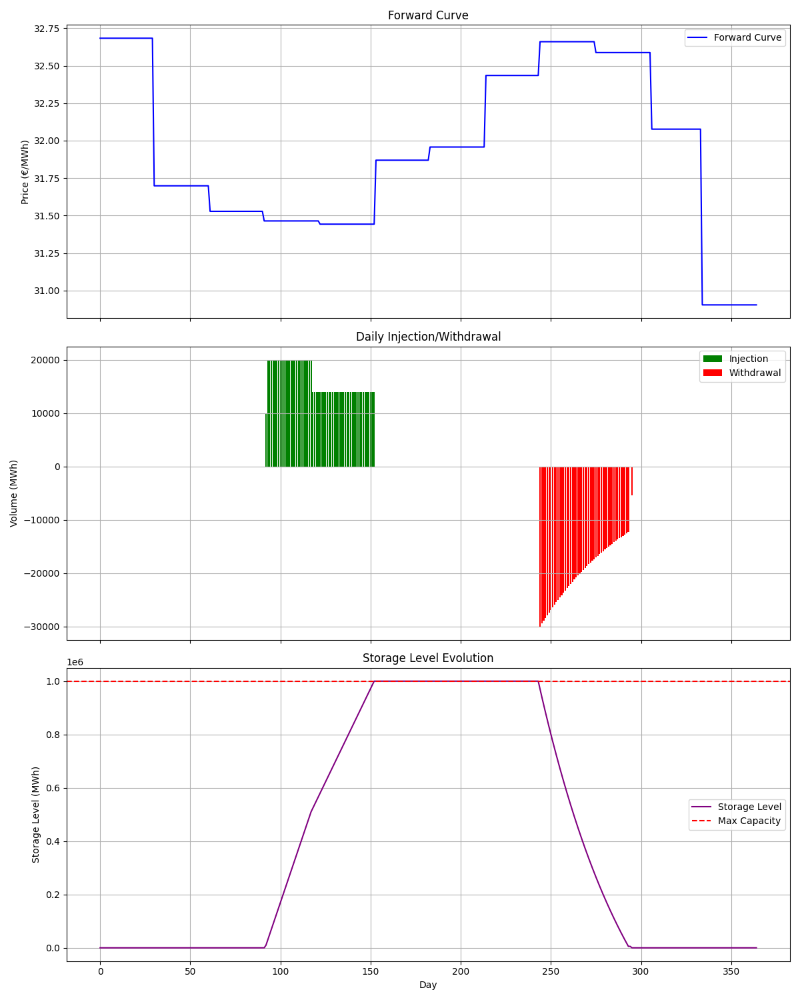

# Gas Storage Optimization Project

## Overview

This project provides a robust solution for optimizing natural gas storage operations to maximize profit in underground gas storage (UGS) auctions. It implements a linear programming model that determines the optimal injection and withdrawal strategy based on forward curve prices and storage facility constraints.

The optimization considers:
- Daily market prices from a forward curve
- Storage capacity constraints
- Variable injection and withdrawal rates based on storage fill levels
- Operational costs

## Theoretical Background

### Gas Storage Economics

Underground Gas Storage (UGS) facilities play a crucial role in the natural gas market by providing flexibility to balance supply and demand. They allow operators to:
1. **Buy low, sell high**: Inject gas when prices are low and withdraw when prices are high
2. **Manage seasonal price spreads**: Take advantage of seasonal price differentials
3. **Provide supply flexibility**: Support system balancing and security of supply

### Market Context and Valuation Approaches

#### Types of Storage Value

Gas storage assets derive value from multiple sources:

1. **Intrinsic Value**: The value captured by optimizing against a known forward curve
   - Deterministic optimization based on current market prices
   - Represents the "locked-in" value that can be hedged
   - The focus of this optimization model

2. **Extrinsic Value**: Additional value from future price volatility and optionality
   - Potential to capture additional spreads as markets move
   - Requires stochastic modeling (not included in this model)
   - Can represent 20-50% additional value beyond intrinsic

3. **Strategic Value**: Non-financial benefits like security of supply and market power
   - Not directly quantifiable in financial terms
   - Important for utilities and system operators

#### Storage Auction Dynamics

Gas storage capacity is often allocated through auctions:

1. **Auction Types**:
   - Pay-as-bid: Each bidder pays their bid amount
   - Uniform price: All winners pay the clearing price
   - Sequential: Multiple rounds with price discovery

2. **Bidding Strategy Considerations**:
   - Competitive pressure from other bidders
   - Information asymmetry regarding valuation methods
   - Risk appetite and portfolio effects
   - Market expectations for future volatility

3. **Optimal Bid Fraction**:
   - Industry practice typically uses 70-90% of intrinsic value
   - Lower percentages increase expected profit but reduce win probability
   - Risk-neutral bidders often use around 80% (our default)

#### Physical Characteristics and Operational Constraints

Understanding the physical constraints of gas storage is crucial:

1. **Storage Types**:
   - Depleted gas fields: Largest capacity, slowest rates
   - Salt caverns: Medium capacity, faster rates
   - Aquifers: Medium-large capacity, slower rates
   - LNG peak-shavers: Small capacity, fastest rates

2. **Key Performance Parameters**:
   - Working Gas Volume (WGV): Total usable capacity
   - Cushion Gas: Minimum required gas to maintain pressure
   - Injection Rate: Maximum daily injection capacity
   - Withdrawal Rate: Maximum daily withdrawal capacity
   - Cycle Time: Time to complete a full injection/withdrawal cycle

3. **Operational Curves**:
   - Injection/withdrawal rates typically depend on fill level
   - Pressure dynamics create non-linear operational constraints
   - Models often use simplified linear or piecewise-linear approximations

The optimization model in this project captures these physical constraints through its formulation of injection and withdrawal curves, ensuring that the resulting operational plan is technically feasible.

### Optimization Model: Linear Programming

The core of this project is a linear programming (LP) model that maximizes the intrinsic value of the storage asset. The intrinsic value represents the profit potential from a static, deterministic strategy based on current forward prices.

#### Key Components of the LP Model:

1. **Decision Variables**:
   - Daily injection volumes: `inject[t]` for each day t
   - Daily withdrawal volumes: `withdraw[t]` for each day t
   - Storage inventory levels: `storage[t]` for each day t
   - Binary variables: `is_first_half[t]` for injection regime switching

2. **Objective Function**:
   - Maximize: Revenue from gas sales - Cost of gas purchases - Variable operational costs
   ```python
   revenue = pulp.lpSum(withdraw[t] * prices[t] for t in range(T))
   cost = pulp.lpSum(inject[t] * prices[t] * (1 + variable_cost_rate) for t in range(T))
   prob += revenue - cost, "Total_Profit"
   ```

3. **Constraints**:
   - Storage balance equations (continuity constraints)
   - Maximum and minimum storage levels
   - Injection rate limitations (dependent on storage fill level)
   - Withdrawal rate limitations (linear dependency on storage fill level)
   - Non-negativity constraints

#### PuLP Implementation Details

The model uses PuLP, a Python library for linear programming, to formulate and solve the optimization problem. Here are the key implementation details:

1. **Big-M Method**:
   The model uses the Big-M method to handle the discrete change in injection capacity when storage crosses the 50% threshold:
   ```python
   M = wgv * 2  # Big-M constant
   # If storage[t-1] < threshold * wgv, is_first_half[t] = 1
   prob += storage[t-1] - injection_threshold * wgv <= M * (1 - is_first_half[t])
   prob += storage[t-1] - injection_threshold * wgv >= -M * is_first_half[t]
   ```
   This mathematical technique converts logical conditions into linear constraints using a large constant (M) and binary variables.

2. **Binary Variables**:
   The model uses binary variables (`is_first_half[t]`) to model the discrete change in injection rates:
   ```python
   is_first_half = [pulp.LpVariable(f"is_first_half_{t}", cat='Binary') for t in range(T)]
   ```
   When `is_first_half[t] = 1`, storage is less than 50% full, allowing 100% of maximum injection rate.
   When `is_first_half[t] = 0`, storage is at least 50% full, restricting injection to 70% of maximum rate.

3. **Solving Algorithm**:
   PuLP uses the Coin-OR Branch and Cut (CBC) solver, which employs:
   - Simplex algorithm for solving the linear relaxation 
   - Branch and Bound technique for handling integer/binary variables
   - Cutting plane methods to improve convergence
   
   The solver finds the optimal solution by:
   1. Solving the relaxed LP problem (ignoring binary constraints)
   2. Using branch and bound to enforce integer/binary constraints
   3. Adding cutting planes to tighten the feasible region
   4. Iteratively improving the solution until optimality is proven

This sophisticated mathematical approach enables the model to properly account for the complex operational constraints of gas storage while determining the profit-maximizing strategy.

#### Injection/Withdrawal Curves Modeling

The model incorporates realistic operational constraints:

- **Injection Curve**: Two-regime model where injection capacity decreases when storage is more than 50% full
  - Below 50%: 100% of maximum rate available
  - Above 50%: 70% of maximum rate available

- **Withdrawal Curve**: Linear model where withdrawal capacity increases with storage level
  - At 0% fill: 40% of maximum rate available
  - At 100% fill: 100% of maximum rate available
  - Linear interpolation between these points

### Bidding Strategy

The bidding strategy is based on the intrinsic value of the storage asset. Since UGS auctions are typically competitive, a strategic approach is used:

1. Calculate the total intrinsic value through optimization
2. Determine a bid fraction (e.g., 80% of intrinsic value)
3. Bid this amount to maintain a profit margin while remaining competitive

This approach balances the probability of winning the auction with ensuring profitability.

## Project Architecture

```
gas-storage-lp/
│
├── src/
│   ├── data_loader.py      # Load and validate forward curve data
│   ├── optimizer.py        # Linear programming optimization model
│   ├── strategy.py         # Generate bidding strategy and operational plan
│   └── visualization.py    # Create visualizations of results
│
├── data/
│   └── UTF-8fwcurve.csv    # Forward curve data
│
├── results/                # Generated output directory
│   └── ugs_plan.png        # Visualization of optimization results
│
├── main.py                 # Main execution script
└── requirements.txt        # Project dependencies
```

### Component Details

#### `data_loader.py`
- Loads forward curve data from CSV
- Validates data format and content
- Converts dates and ensures complete coverage of the storage period
- Indexes days from 0 to 364 for optimization

#### `optimizer.py` 
- Implements the core LP model using PuLP
- Defines decision variables, objective function, and constraints
- Models complex injection/withdrawal curves
- Returns detailed optimization results

#### `strategy.py`
- Calculates optimal bidding values based on optimization results
- Computes key performance metrics
- Formats results for reporting and visualization

#### `visualization.py`
- Creates comprehensive visualizations of the optimized strategy
- Plots forward curve, daily actions, and storage levels
- Generates publication-quality graphics for analysis

#### `main.py`
- Coordinates the overall workflow
- Integrates all components into a complete solution

## Installation Instructions

### Prerequisites
- Python 3.10 or higher
- pip (Python package installer)
- Git (optional, for cloning the repository)

### Setup

1. Clone the repository:
   ```bash
   git clone https://github.com/yourusername/gas-storage-lp.git
   cd gas-storage-lp
   ```
   Alternatively, download and extract the ZIP file from GitHub.

2. Create and activate a virtual environment (recommended):
   ```bash
   # On Linux/macOS
   python -m venv venv
   source venv/bin/activate
   
   # On Windows
   python -m venv venv
   venv\Scripts\activate
   ```

3. Install dependencies:
   ```bash
   pip install -r requirements.txt
   ```
   
   This will install:
   - pandas 2.2.2: Data manipulation and analysis
   - numpy 2.1.1: Numerical computing
   - PuLP 2.9.0: Linear programming solver
   - matplotlib 3.9.2: Data visualization

## Usage Guide

### Project Structure Setup

Ensure your project has the following structure:
```
gas-storage-lp/
├── data/
│   └── UTF-8fwcurve.csv    # Place your forward curve data here
├── src/
│   ├── data_loader.py
│   ├── optimizer.py
│   ├── strategy.py
│   └── visualization.py
├── main.py
└── requirements.txt
```

### Running the Optimization

1. Place your forward curve CSV file in the `data/` directory

2. Execute the main script to run the full optimization:
   ```bash
   python main.py
   ```

3. View the results in the `results/` directory:
   - `ugs_plan.png`: Visualization of the optimization results
   - Terminal output will show the recommended bid and profit metrics

### Command-line Arguments (Optional Enhancement)

You can enhance `main.py` to accept command-line arguments:

```python
import argparse

def parse_args():
    parser = argparse.ArgumentParser(description='Gas Storage Optimization')
    parser.add_argument('--curve', type=str, default='data/UTF-8fwcurve.csv',
                        help='Path to forward curve CSV file')
    parser.add_argument('--wgv', type=float, default=1_000_000,
                        help='Working gas volume in MWh')
    parser.add_argument('--bid-fraction', type=float, default=0.8,
                        help='Fraction of intrinsic value to bid (e.g., 0.8 for 80%)')
    return parser.parse_args()

def main():
    args = parse_args()
    # Use args.curve, args.wgv, etc. in your code
```

### Configuration

The optimization parameters can be customized in `main.py`:

- `wgv`: Working gas volume in MWh (default: 1,000,000)
- `max_injection_rate`: Maximum daily injection rate (default: 20,000 MWh/day)
- `injection_threshold`: Storage level threshold for injection rate change (default: 0.5 or 50%)
- `injection_first_half`: Injection rate factor for first half of storage (default: 1.0 or 100%)
- `injection_second_half`: Injection rate factor for second half of storage (default: 0.7 or 70%)
- `max_withdrawal_rate`: Maximum daily withdrawal rate (default: 30,000 MWh/day)
- `withdrawal_min_factor`: Withdrawal rate factor when storage is empty (default: 0.4 or 40%)
- `withdrawal_max_factor`: Withdrawal rate factor when storage is full (default: 1.0 or 100%)
- `variable_cost_rate`: Variable cost as a percentage of injected gas cost (default: 0.012 or 1.2%)
- `bid_fraction`: Percentage of intrinsic value to bid in the auction (default: 0.8 or 80%)

### Troubleshooting

Common issues and solutions:

1. **PuLP Solver Error**: If you encounter solver-related errors:
   ```
   pip install pulp --upgrade
   ```
   
2. **Missing CBC Solver**: PuLP requires a solver. It comes with CBC, but if it's missing:
   ```python
   # Explicitly specify solver path in optimizer.py
   prob.solve(pulp.PULP_CBC_CMD(msg=0, path='/path/to/cbc'))
   ```

3. **Date Format Issues**: Ensure your CSV dates are in DD/MM/YYYY format as expected by the data loader

### Output

The program generates:

1. A bidding strategy with:
   - Recommended bid per MWh and total bid
   - Expected profit calculation
   - Intrinsic value analysis

2. Detailed operational plan with daily:
   - Injection volumes
   - Withdrawal volumes
   - Storage inventory levels

3. Visualizations in the `results/` directory

## Analyzing Results

### Understanding the Visualization

The `ugs_plan.png` visualization contains three panels that help interpret the optimization results:



1. **Top Panel - Forward Curve**:
   - Shows the market price forecast for the entire storage period
   - Helps identify seasonal patterns and price volatility
   - Look for winter-summer spreads, which drive storage value

2. **Middle Panel - Injection/Withdrawal Actions**:
   - Green bars (positive): Injection activities (buying gas)
   - Red bars (negative): Withdrawal activities (selling gas)
   - The pattern should follow a "buy low, sell high" strategy

3. **Bottom Panel - Storage Level**:
   - Purple line: Daily storage inventory level
   - Red dashed line: Maximum capacity (WGV)
   - Shows how the storage is utilized throughout the year
   - Typically fills during summer (low prices) and empties during winter (high prices)

### Interpreting the Bidding Strategy

The optimization produces several key metrics to inform your bidding decision:

1. **Intrinsic Value**: The theoretical maximum profit potential based on perfect foresight of the forward curve.

2. **Bid Calculation**: The recommended bid is calculated as:
   ```
   Bid per MWh = Intrinsic Value per MWh × Bid Fraction
   Total Bid = Bid per MWh × Working Gas Volume
   ```

3. **Expected Profit**: The profit you can expect to achieve after paying the bid amount:
   ```
   Expected Profit = Intrinsic Value - Total Bid
   ```

4. **Bid Competitiveness Assessment**:
   - A higher bid increases chances of winning but reduces expected profit
   - A lower bid increases expected profit but reduces chances of winning
   - The default 80% bid fraction balances these two considerations

### Key Performance Indicators

When analyzing the results, focus on these important metrics:

1. **Economic Indicators**:
   - Intrinsic Value: The maximum achievable profit
   - Intrinsic Value per MWh: Normalized by storage capacity
   - Expected Profit: What remains after paying the bid amount
   - Cost of Injection: Total cost to purchase and inject gas
   - Revenue from Withdrawal: Total revenue from selling gas

2. **Operational Indicators**:
   - Total Gas Injected: Total volume injected over the period
   - Total Gas Withdrawn: Total volume withdrawn over the period
   - Maximum Storage Utilization: Highest percentage of WGV used
   - Final Storage Level: Ending inventory (ideally close to zero)
   - Injection Days: Number of days with injection activity
   - Withdrawal Days: Number of days with withdrawal activity
   - Hold Days: Number of days with no activity

3. **Efficiency Metrics**:
   - Capacity Utilization: How effectively the storage space is used
   - Cycle Count: Number of full injection/withdrawal cycles
   - Churn Rate: Total gas moved through the facility relative to WGV

### Typical Seasonal Patterns

In a normal market environment, you would typically observe:

1. **Summer Operation (Apr-Sep)**:
   - Lower prices
   - Predominantly injection activities
   - Gradually increasing storage levels

2. **Winter Operation (Oct-Mar)**:
   - Higher prices
   - Predominantly withdrawal activities
   - Gradually decreasing storage levels

3. **Transition Periods**:
   - Mixed activities during spring and fall
   - Potential for short-term optimizations based on price volatility

## Example Results

When run with the provided forward curve and default parameters, the optimization produces:

### Visualization Output


The visualization includes:
- Top panel: Forward curve prices throughout the storage period
- Middle panel: Daily injection (green) and withdrawal (red) volumes
- Bottom panel: Storage inventory level evolution with maximum capacity shown

### Key Performance Metrics

- **Bidding Strategy**:
  - Intrinsic Value: €X.XX per MWh
  - Recommended Bid: €X.XX per MWh (80% of intrinsic value)
  - Total Bid Amount: €X,XXX,XXX

- **Operational Summary**:
  - Total Gas Injected: X,XXX,XXX MWh
  - Total Gas Withdrawn: X,XXX,XXX MWh
  - Maximum Storage Utilization: XX.X%
  - Injection Days: XX
  - Withdrawal Days: XX
  - Hold Days: XX

- **Profitability Analysis**:
  - Total Revenue: €XX,XXX,XXX
  - Total Cost: €XX,XXX,XXX
  - Profit Margin: XX.X%
  - Return on Investment: XX.X%

## Advanced Usage

### Sensitivity Analysis

You can perform sensitivity analysis by modifying key parameters and observing the impact on profitability:

```python
# Example: Testing different bid fractions
for bid_fraction in [0.7, 0.75, 0.8, 0.85, 0.9]:
    result = calculate_bid_and_plan(optimization_result, bid_fraction=bid_fraction)
    print(f"Bid Fraction: {bid_fraction}, Expected Profit: {result['expected_profit']}")
```

### Using Different Forward Curves

To use an alternative forward curve:

1. Prepare a CSV file with columns 'date' and 'price'
2. Ensure dates cover the full storage period (April 1, 2026 to March 31, 2027)
3. Update the filepath in `main.py`

## Advanced Modeling Concepts

### Mixed Integer Linear Programming (MILP)

The storage optimization is a Mixed Integer Linear Programming problem because it combines:
- Continuous variables (injection/withdrawal volumes, storage levels)
- Binary variables (storage regime indicators)

This combination allows the model to capture discrete operational states while maintaining computational tractability.

### Linear Approximation of Non-Linear Constraints

The withdrawal rate constraint is non-linear in its natural form, as it depends on the product of two variables:
- Maximum withdrawal rate
- Fill percentage 

The model linearizes this by creating a direct relationship between the storage level and withdrawal capacity:

```python
fill_percentage = pulp.LpVariable(f"fill_{t}", lowBound=0, upBound=1)
prob += fill_percentage * wgv == storage[t-1]
prob += withdraw[t] <= max_withdrawal_rate * (
    withdrawal_min_factor + (withdrawal_max_factor - withdrawal_min_factor) * fill_percentage
)
```

### CBC Solver Performance Considerations

The Coin-OR CBC solver used by PuLP has several performance characteristics to consider:

1. **Presolve Phase**: The solver first performs a presolve to reduce problem size and identify redundant constraints.

2. **Cutting Planes**: CBC automatically generates cutting planes to tighten the LP relaxation, which can significantly improve solution times.

3. **Branching Strategies**: For integer variables, CBC uses sophisticated branching strategies to decide which variables to branch on.

4. **Solution Time vs. Problem Size**: Solution time scales approximately exponentially with the number of binary variables.

5. **Optimality Gap**: The solver can terminate early with a near-optimal solution if the gap between the best integer solution and best bound is small enough.

For this gas storage model, with 365 time periods and multiple binary variables per period, the solver typically finds the optimal solution efficiently due to the problem's special structure and the strong LP relaxation provided by the formulation.

## Conclusion and Limitations

### Model Performance

The implemented gas storage optimization model performs well for the given assignment, producing reasonable and economically sound results:

- **Economic Performance**:
  - Intrinsic Value: 0.808 €/MWh
  - Recommended Bid: 0.646 €/MWh (80% of intrinsic value)
  - Expected Profit: 0.162 €/MWh after paying the storage fee

- **Operational Efficiency**:
  - Complete utilization of storage capacity (100% maximum utilization)
  - Balanced injection (61 days) and withdrawal (51 days) activity
  - Selective trading on the most profitable days (253 hold days)

The model successfully captures the available value from the forward curve while respecting all operational constraints of the storage facility.

### Key Limitations

While effective for this specific case, it's important to recognize the model's limitations:

1. **Deterministic Framework**:
   - The model assumes a single, fixed forward curve
   - It cannot adapt to changing market conditions or price updates
   - Results are optimal only for the exact forward curve provided

2. **No Stochastic Modeling**:
   - Real gas markets exhibit significant price volatility and uncertainty
   - This model does not capture extrinsic value from price volatility
   - Stochastic models with multiple price scenarios would be needed to fully value the optionality of storage

3. **Forward Curve Specificity**:
   - Results will not generalize to other forward curves without re-running the optimization
   - The bidding strategy is specific to the current market outlook
   - Different seasonal patterns or volatility would yield significantly different results

4. **No Market Feedback Effects**:
   - The model assumes storage operations don't influence market prices
   - In reality, large storage operators can have market impact

### Future Enhancements

To address these limitations, potential future enhancements could include:

1. Stochastic optimization with multiple price scenarios
2. Rolling horizon optimization with periodic model updates
3. Integration with forecasting models to generate forward curve scenarios
4. Market impact modeling for large storage volumes
5. Inclusion of additional constraints such as minimum cycle requirements or ratchets

## Contributing

Contributions to improve the project are welcome. Please follow these steps:

1. Fork the repository
2. Create a feature branch
3. Make your changes
4. Submit a pull request

## License

[MIT License](LICENSE)

## Acknowledgments

- PuLP library for linear programming functionality
- Pandas for data handling
- Matplotlib for visualization

## Contact

For questions or support, please contact your-email@example.com
